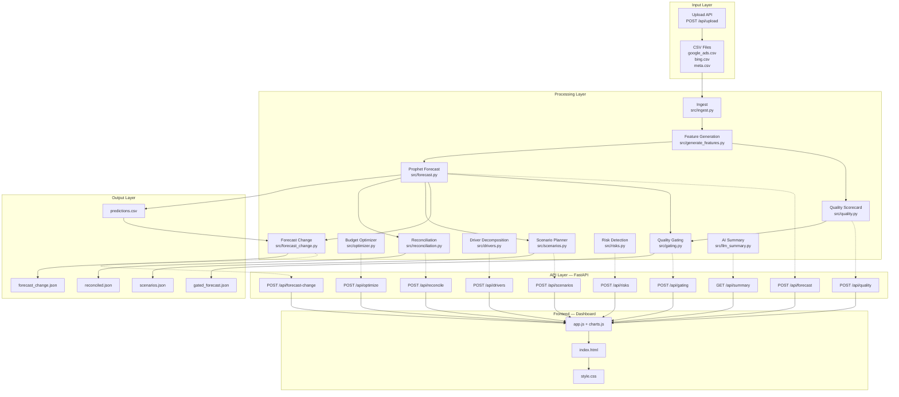
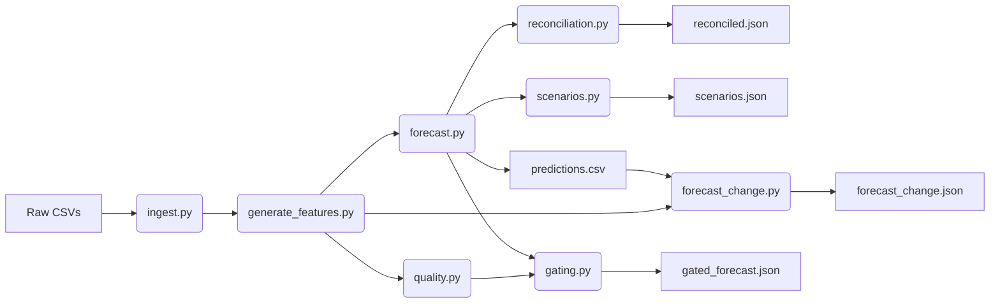
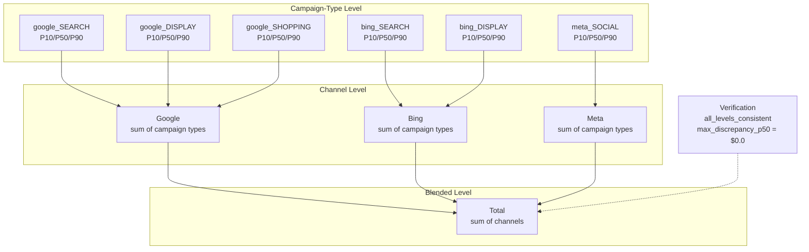
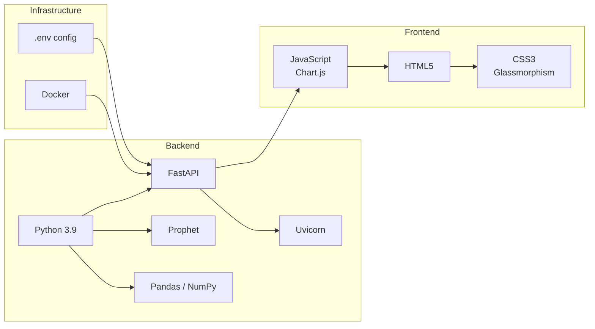

# Architecture

## System Overview



---

## Pipeline Data Flow



---

## Reconciliation Architecture



---

## Budget Optimizer Flow

```mermaid
flowchart TD
    INPUT[Total Budget + Min/Max Constraints] --> K[Compute k per channel<br/>revenue = k × ln(spend + 1)]
    K --> WF[Water-Filling Loop]
    WF --> LAMBDA[Binary search λ<br/>marginal ROAS = k / (spend + 1)]
    LAMBDA --> ALLOC[Allocate budget<br/>spend = k/λ - 1]
    ALLOC --> CHECK{Constrained?<br/>spend < min or > max}
    CHECK -->|Yes| FIX[Fix constrained channel<br/>redistribute remainder]
    CHECK -->|No| DONE{All channels<br/>processed?}
    FIX --> WF
    DONE -->|No| WF
    DONE -->|Yes| RESULT[Optimal allocations<br/>marginal ROAS equalized]
```

---

## Fisher Decomposition

```mermaid
flowchart LR
    subgraph Inputs["Input Periods"]
        P1[Period 1<br/>spend₁, revenue₁, ROAS₁]
        P2[Period 2<br/>spend₂, revenue₂, ROAS₂]
    end

    subgraph Effects["Fisher Ideal Effects"]
        SE[Spend Effect<br/>Δspend × avg(ROAS)]
        EE[Efficiency Effect<br/>ΔROAS × avg(spend)]
    end

    subgraph Result["Result"]
        TOTAL[ΔRevenue<br/>= spend_effect + efficiency_effect<br/>✓ zero residual]
    end

    P1 --> SE
    P2 --> SE
    P1 --> EE
    P2 --> EE
    SE --> TOTAL
    EE --> TOTAL
```

---

## Frontend Architecture

```mermaid
graph TB
    subgraph Pages["Pages"]
        LANDING[landing.html<br/>SaaS marketing page]
        DASHBOARD[index.html<br/>Analytics dashboard]
    end

    subgraph DashboardSections["Dashboard Sections"]
        HERO[Upload Zone<br/>Drag-drop CSV upload]
        QUALITY[Data Quality<br/>Scorecard + A-F grade]
        METRICS[Forecast Metrics<br/>Revenue, ROAS, Confidence]
        CHARTS[Probabilistic Charts<br/>Chart.js with P10/P50/P90]
        RECON[Reconciled Table<br/>Campaign → Channel → Blended]
        SIM[Budget Simulator<br/>What-if slider]
        OPT[Budget Optimizer<br/>Allocation bars]
        SCEN[Scenario Compare<br/>Base/Cons/Aggr table]
        DRIVERS[Driver Decomposition<br/>Spend vs Efficiency bars]
        FC[Forecast Change<br/>Actual vs Forecast]
        RISKS[Risk Alerts<br/>Severity-colored cards]
        SUMMARY[AI Causal Summary<br/>Claude bullet points]
    end

    DASHBOARD --> HERO
    DASHBOARD --> QUALITY
    DASHBOARD --> METRICS
    DASHBOARD --> CHARTS
    DASHBOARD --> RECON
    DASHBOARD --> SIM
    DASHBOARD --> OPT
    DASHBOARD --> SCEN
    DASHBOARD --> DRIVERS
    DASHBOARD --> FC
    DASHBOARD --> RISKS
    DASHBOARD --> SUMMARY
```



---

## Technology Stack


