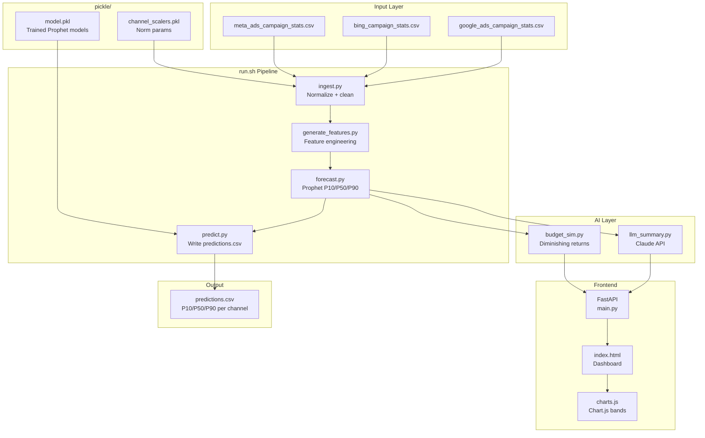

# Architecture Overview

## System Diagram

## Stack

| Layer | Technology |
|-------|-----------|
| Forecasting | Facebook Prophet 1.1.5 |
| Backend | FastAPI + Python 3.11 |
| Frontend | HTML5 + CSS3 + Vanilla JS |
| Charts | Chart.js 4.x |
| LLM | Anthropic Claude API |
| Data | Pandas + PyArrow |
| Model storage | joblib pickle |
| Submission | run.sh -> CSV |

## Data Flow

1. `run.sh ./data ./pickle/model.pkl ./output/predictions.csv`
2. `generate_features.py` reads all CSVs dynamically from `data/`
3. Normalizes: Google cost micros / 1M, Bing revenue proxy, Meta attribution flags
4. Saves `features.parquet`
5. `predict.py` loads `model.pkl`, runs Prophet forecast per channel
6. Writes `predictions.csv` with P10/P50/P90 per channel per horizon
